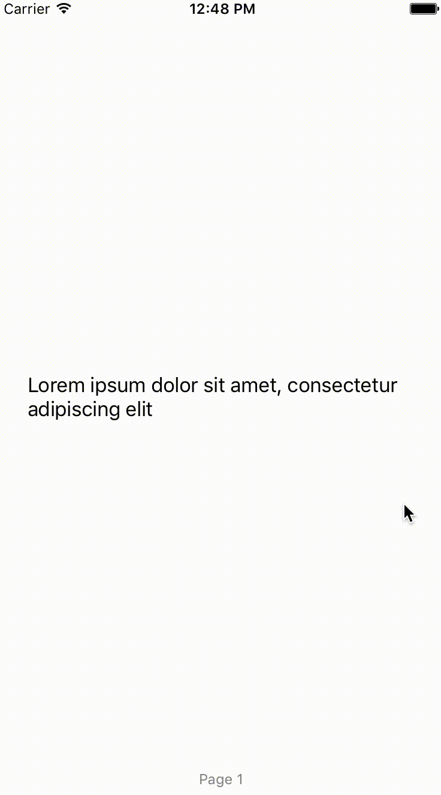

# FlexiblePageViewController

[](https://travis-ci.org/mu29/FlexiblePageViewController)
[](http://cocoapods.org/pods/FlexiblePageViewController)
[](http://cocoapods.org/pods/FlexiblePageViewController)
[](http://cocoapods.org/pods/FlexiblePageViewController)

UIPageViewController for processing arbitrary data

## Introduction

We show data imported from a network or database in a table view through pagination(a.k.a infinite scroll).
`FlexiblePageViewController` is its pager version that extends `UIPageViewController`.

## Installation

`FlexiblePageViewController` is available through [CocoaPods](http://cocoapods.org). To install
it, simply add the following line to your Podfile:

```ruby
pod "FlexiblePageViewController"
```

## Description

To handle arbitrary data, `FlexiblePageViewController` provides `FlexiblePageViewDataSource` and `FlexiblePageViewDelegate` protocols.

In `FlexiblePageViewDataSource`, you should return the number of data to display and the data at a specific index.

```swift
func numberOfData(in pageView: FlexiblePageViewController) -> Int {
  return contents.count
}

func flexiblePageView(_ pageView: FlexiblePageViewController, dataAt index: Int) -> Any? {
  guard contents.indices.contains(index) else { return nil }
  return contents[index]
}
```

In `FlexiblePageViewDelegate`, you should performs pagination operations.

```swift
func flexiblePageView(_ pageView: FlexiblePageViewController, lastIndex index: Int) {
  loadData(at: page)
}
```

The view controller acting as the "page" to show each item is assigned to the `pageInfo` as a tuple.
```swift
pageContainer.pageInfo = (storyboard: "Main", view: ContentViewController.self)
```


## Example



The example project loads and displays 10 pages at first. After passing the page several times, it loads next 10 items. (*pagination*)

`MainViewController` that act as a pager:

```swift
import UIKit
import FlexiblePageViewController

class MainViewController: UIViewController {

  @IBOutlet weak var pageLbl: UILabel!

  var pageContainer: FlexiblePageViewController!
  var contents: [String] = []
  var page = 0
  let contentDataSource = ContentDataSource()

  override func viewDidLoad() {
    super.viewDidLoad()
    loadData(at: page) {
      self.setPager()
    }
  }

  private func setPager() {
    pageContainer = FlexiblePageViewController()
    pageContainer.pageDataSource = self
    pageContainer.pageDelegate = self
    pageContainer.numberOfItemsPerPage = 10
    pageContainer.didPageSelected = didPageSelected
    pageContainer.pageInfo = (storyboard: "Main", view: ContentViewController.self)
    view.addSubview(pageContainer.view)
    view.sendSubview(toBack: pageContainer.view)
  }

  func didPageSelected(index: Int) {
    pageLbl.text = "Page \(index + 1)"
  }

  func loadData(at page: Int, onComplete: (() -> Void)? = nil) {
    contentDataSource.loadData(at: page) {
      self.contents.append(contentsOf: $0)
      self.page += 1
      onComplete?()
    }
  }

}

extension MainViewController: FlexiblePageViewDataSource, FlexiblePageViewDelegate {

  func numberOfData(in pageView: FlexiblePageViewController) -> Int {
    return contents.count
  }

  func flexiblePageView(_ pageView: FlexiblePageViewController, dataAt index: Int) -> Any? {
    guard contents.indices.contains(index) else { return nil }
    return contents[index]
  }

  func flexiblePageView(_ pageView: FlexiblePageViewController, lastIndex index: Int) {
    loadData(at: page)
  }

}
```

`ContentViewController` to show each data:

```swift
import UIKit
import FlexiblePageViewController

class ContentViewController: UIViewController {

  @IBOutlet weak var contentLbl: UILabel!

  var content: String = ""

  // Need to receive data from pager
  override func set(_ extras: [String : Any]) {
    content = extras["data"] as? String ?? ""
  }

  override func viewWillAppear(_ animated: Bool) {
    super.viewWillAppear(animated)
    contentLbl.text = content
  }

}
```

See full example [here](https://github.com/mu29/FlexiblePageViewController/blob/master/Example/FlexiblePageViewController).

To run the example project, clone the repo, and run `pod install` from the Example directory first.

## APIs

- **`.pageDataSource: FlexiblePageViewDataSource?`**

- **`.pageDelegate: FlexiblePageViewDelegate?`**

- **`.numberOfItemsPerPage: Int = 20`**

    Number of items received in a database or network at a time.

- **`.didPageSelected: ((Int) -> Void)?`**

    Function to be executed when the page is selected. Get the current page index as an argument.

- **`.currentIndex: Int = 0`**

    Index of page to be shown

- **`.pageInfo: (storyboard: String, view: UIViewController.Type)`**

    Storyboard name and identifier of the view controller to show each item


## Author

InJung Chung / [@mu29](http://mu29.github.io/)

## License

`FlexiblePageViewController` is available under the MIT license. See the [LICENSE](https://github.com/mu29/FlexiblePageViewController/blob/master/LICENSE) file for more info.
